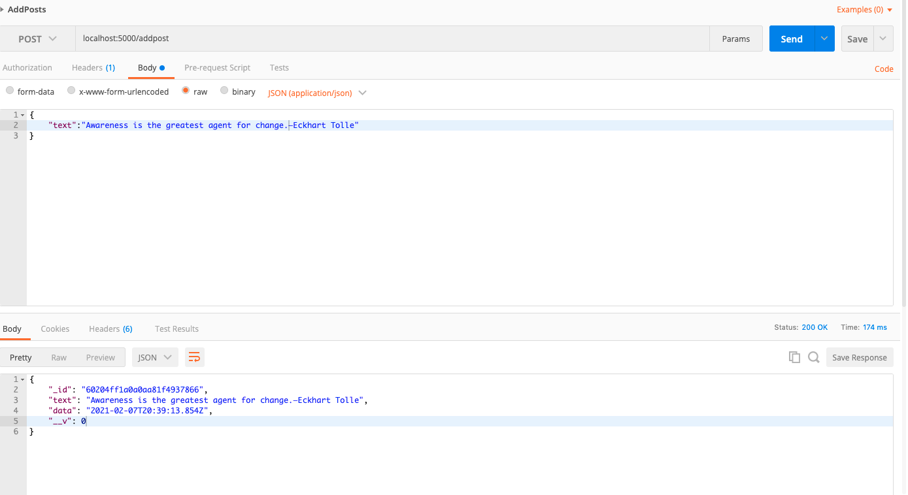
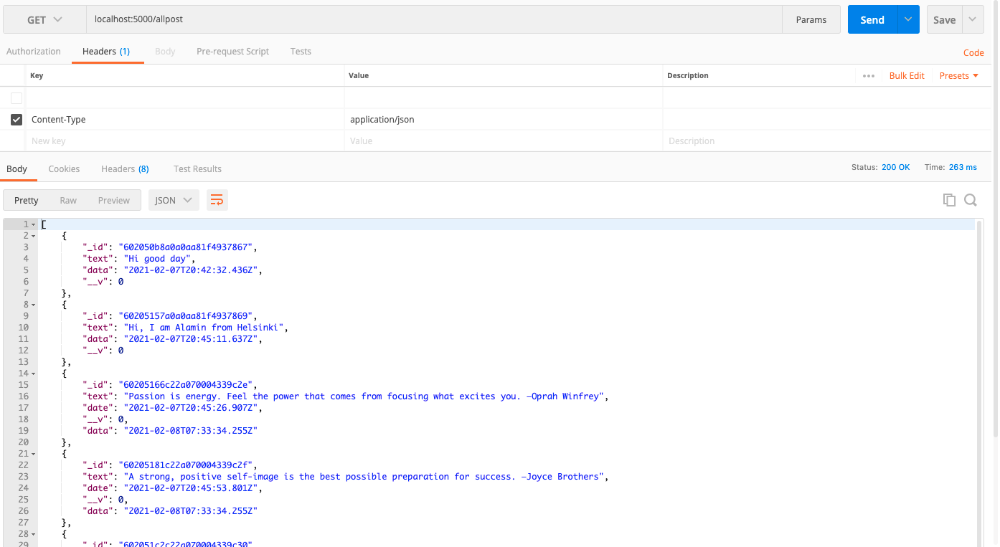
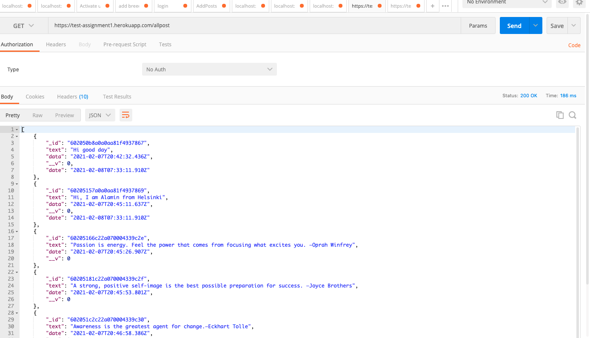
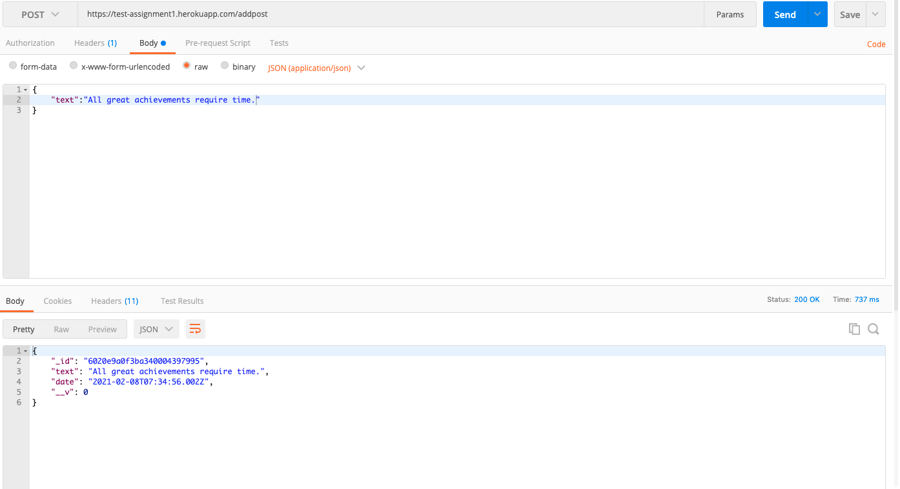
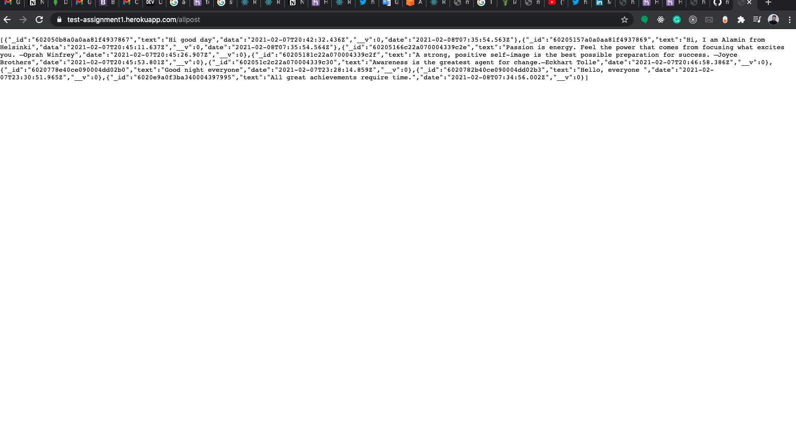
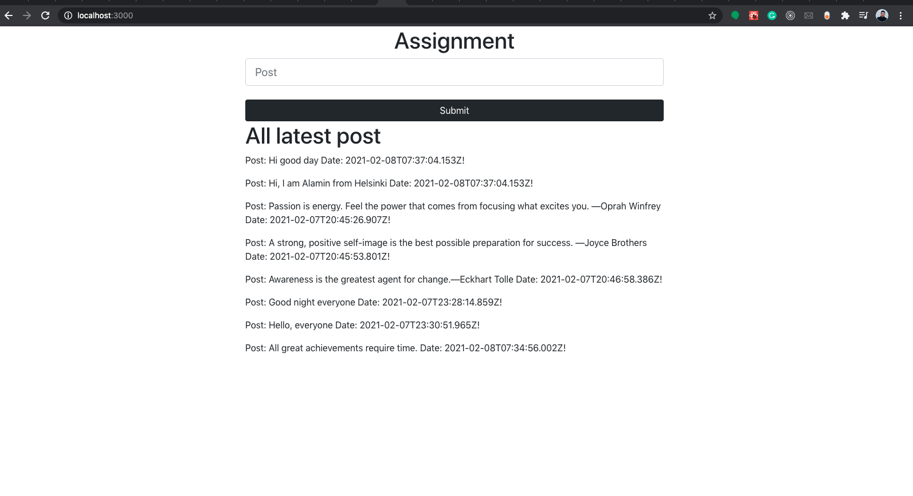
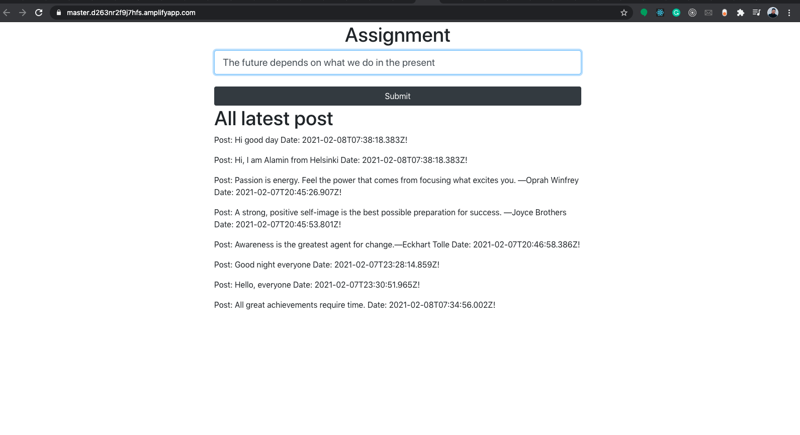
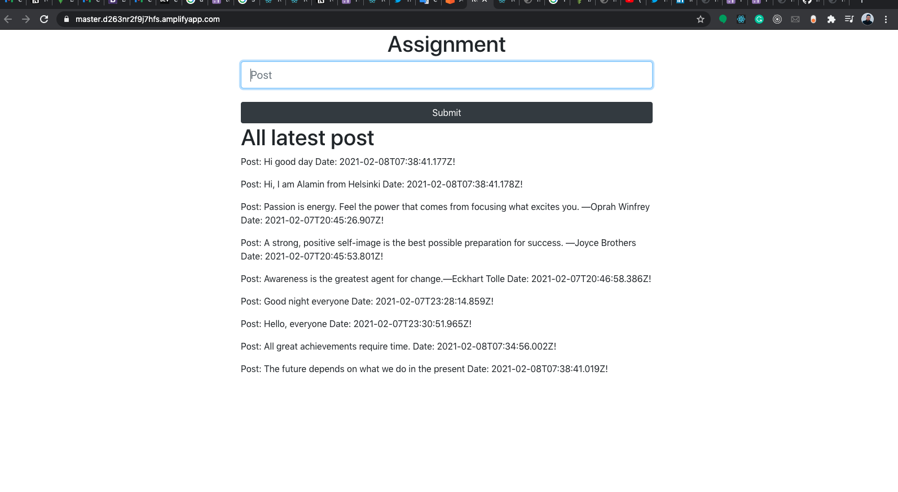

# prototype

## Feature
- `Add post in localhost by postman,`

` If you want to run this project locally just clone the repo then install backend dependency, packages for run backend install npm and for frontend install yarn`

- `Allpost shows in localhost by postman,`

- `Add post in api by postman,`

- `All post shows in api by postman,`

- `API deploy in Heroku`

- `frontend run in localhost,`

`If you want to run this project locally just clone the repo then install frontend packages and install yarn`

- `Add post in aws deploy link,`

`If you want to add any post then run this https://master.d263nr2f9j7hfs.amplifyapp.com/ `

- `Added post in aws deploy link,`

